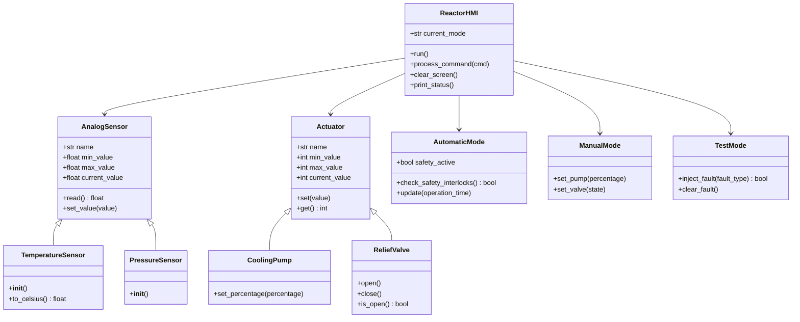
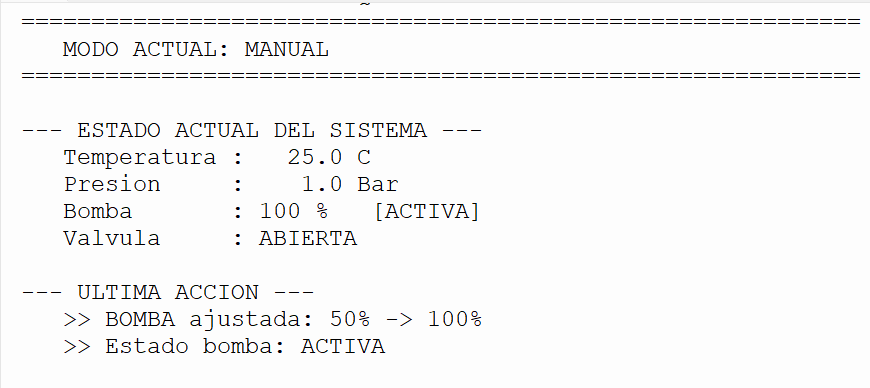
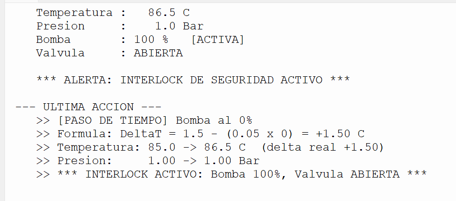
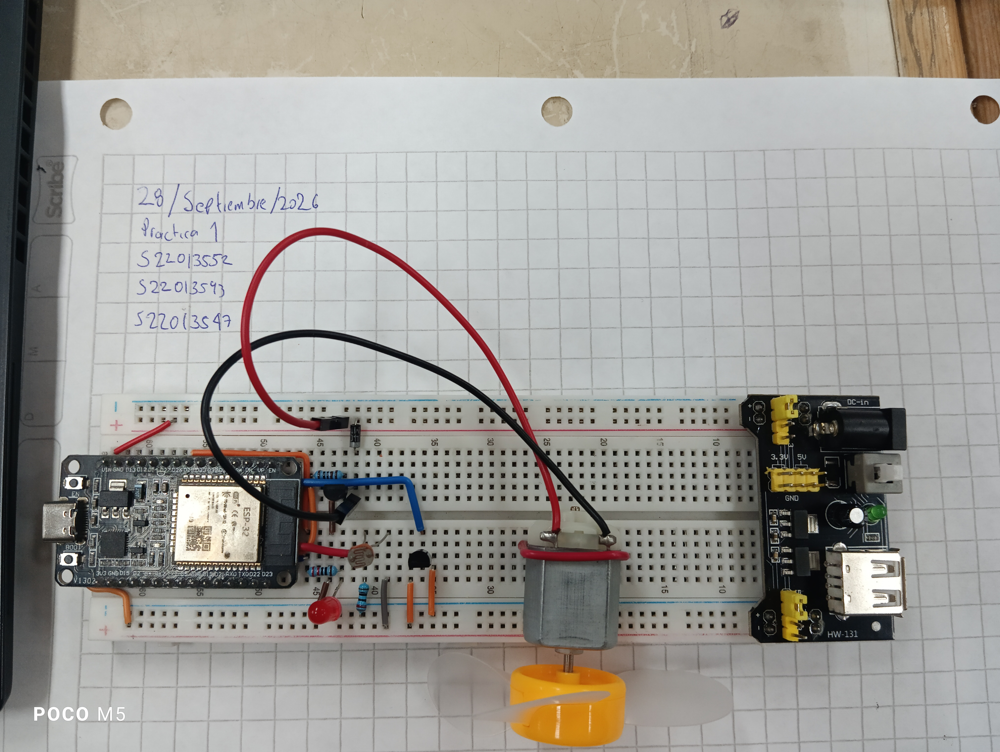
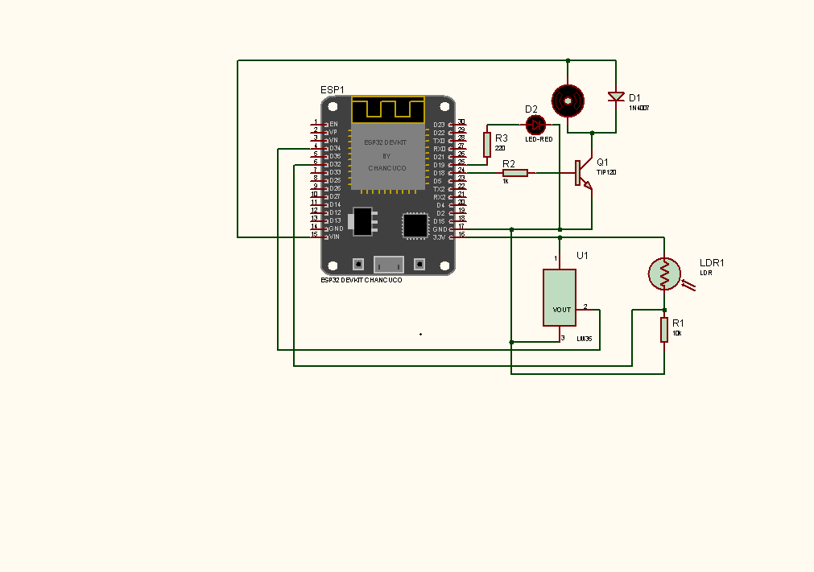

# [EQUIPO 8]
## **Reporte de Práctica de Laboratorio — Programación Orientada a Objetos**
### **EE: Temas Selectos de IIE II (Código: IEDI 18005)**
#### **Facultad de Instrumentación Electrónica — Universidad Veracruzana**

---

### **Información General del Equipo**

*   **Número de Práctica:** Práctica 1
*   **Título de la Práctica:** Sistemas de Control con Python y aplicación en ESP32
*   **Fecha de Entrega:** 28/09/2026
*   **Enlace al Repositorio de GitHub:** Enlace al repositorio de la práctica (https://share.google/Sd96ZDj7oFJReIWZa)

| Nombre Completo del Integrante | Matrícula UV | Usuario de GitHub |
| :--- | :--- | :--- |
| Juan Marín Alfredo | S22013552 | @alfredojuanmarin-create
| López De La Cruz Demian Enrique | S22013547 | @LukiiMoi |
| Padilla García Mario Gerardo | S22013593 | @MarioGPadilla |

---

### **Sección 1: Mapeo de Abstracción (Hardware ➔ POO)**

*En este apartado demostrarán cómo convirtieron sus componentes físicos (sensores, actuadores, controladores) en objetos lógicos dentro de su programa de software en C++ o Python.*

#### **1.1. Diagrama de Clases UML**

#### **1.2. Mapeo de Atributos (Características Físicas ➔ Variables de Clase)**

*   **Clase `AnalogSensor`**:
    *   `name`: Representa el nombre del sensor físico (ej. "Temperatura", "Presión").
    *   `min_value` y `max_value`: Almacenan los límites físicos de operación según la hoja de datos del hardware (0–150 °C para temperatura, 0–15 Bar para presión).
    *   `current_value`: Guarda el último valor leído del sensor analógico simulado.

*   **Clase `TemperatureSensor`**:
    *   `min_value` y `max_value`: Heredados de `AnalogSensor` e inicializados en `0.0` y `150.0` respectivamente.
    *   `current_value`: Valor inicial de `25.0 °C` (temperatura ambiente).

*   **Clase `PressureSensor`**:
    *   `min_value` y `max_value`: Heredados de `AnalogSensor` e inicializados en `0.0` y `15.0` respectivamente.
    *   `current_value`: Valor inicial de `1.0 Bar`.

*   **Clase `Actuator`**:
    *   `min_value` y `max_value`: Representan los límites físicos del actuador (0–100 % para bomba, 0/1 para válvula).
    *   `current_value`: Estado actual del actuador.

*   **Clase `CoolingPump`**:
    *   Hereda de `Actuator` con rango `0–100 %` (modulación proporcional).

*   **Clase `ReliefValve`**:
    *   Hereda de `Actuator` con rango `0–1` (control digital ON/OFF).

*   **Pines GPIO (ESP32)**:
    *   `PIN_TEMP`: Pin físico del ADC (GPIO 34) conectado al sensor de temperatura LM35.
    *   `PIN_LDR`: Pin físico del ADC (GPIO 32) conectado al sensor de luz LDR.
    *   `PIN_FAN`: Pin PWM (GPIO 18) conectado al ventilador (motor DC).
    *   `PIN_LED`: Pin PWM (GPIO 19) conectado al LED de potencia.

*   **Variables de estado (ESP32)**:
    *   `temperatura`: Almacena el valor convertido a grados Celsius del LM35.
    *   `luz`: Nivel de luz ambiental en porcentaje (lectura del LDR).
    *   `fan_duty`: Duty cycle del ventilador (0–255).
    *   `led_duty`: Duty cycle del LED (0–255).

#### **1.3. Mapeo de Métodos (Acciones del Hardware ➔ Funciones miembro)**

*   **Clase `AnalogSensor`**:
    *   `read()`: Devuelve el valor actual del sensor (equivalente a leer un registro del ADC).
    *   `set_value(value)`: Establece un valor validando el rango; útil para el Modo de Pruebas al inyectar fallos.

*   **Clase `Actuator`**:
    *   `set(value)`: Ajusta el valor del actuador validando el rango (equivalente a escribir en un registro PWM).

*   **Clase `CoolingPump`**:
    *   `set_percentage(percentage)`: Envía el duty cycle a la bomba (modulación proporcional 0–100 %).

*   **Clase `ReliefValve`**:
    *   `open()` y `close()`: Control digital ON/OFF de la válvula de alivio.
    *   `is_open()`: Devuelve el estado lógico de la válvula.

*   **Clase `AutomaticMode`**:
    *   `check_safety_interlocks()`: Implementa los interlocks de seguridad (T > 85 °C o P > 12 Bar).
    *   `update()`: Aplica la fórmula dinámica `DeltaT = 1.5 – (0.05 × %Bomba)`.

*   **Clase `TestMode`**:
    *   `inject_fault(fault_type)`: Simula fallos artificiales en los sensores (temperatura alta, presión alta, offsets, ruido).
    *   `clear_fault()`: Restaura los valores iniciales del sistema.

*   **Clase `ReactorHMI`**:
    *   `clear_screen()`: Usa `os.system('cls')` o `os.system('clear')` para evitar el scroll infinito.
    *   `run()`: Bucle principal de la HMI.
    *   `process_command(cmd)`: Interpreta los comandos del usuario.

*   **ESP32 (C++)**:
    *   `leerSensores()`: Lee el ADC de 12 bits y convierte el voltaje a temperatura y porcentaje de luz.
    *   `controlTemperatura()`: Activa el ventilador al 100 % PWM si la temperatura excede 30 °C.
    *   `controlLuminosidad()`: Realiza un mapeo proporcional inverso LDR → LED.
    *   `procesarComandos()`: Interpreta comandos del Monitor Serie.
    *   `enviarTelemetria()`: Envía los datos en formato JSON estructurado. 

---

### **Sección 2: El Registro de Errores ("Bug Log")**

| # | Falla Física o Lógica Detectada | Causa Raíz (Hardware / Software) | Solución Técnica Implementada en Código / Conexión |
| :--- | :--- | :--- | :--- |
| **1** | Al presionar `s` en el simulador, la temperatura no cambiaba y no se reflejaba ningún mensaje en pantalla. | Los comandos que no cumplían una condición (como estar en modo AUTO) se ignoraban silenciosamente, dando la impresión de que el programa estaba roto. | Se agregaron mensajes explícitos en la sección "ÚLTIMA ACCIÓN" que indican si el comando solo funciona en otro modo, y se muestra la fórmula aplicada junto al delta teórico vs. el real. |
| **2** | Al intentar crear la estructura de carpetas con clic derecho en VS Code, las carpetas se creaban como un solo nombre concatenado (ej. `version-2.0.0-schematics-serial_commands`). | El sistema de archivos interpretaba el nombre completo como una sola carpeta porque no existía la ruta padre o se escribió sin separadores válidos. | Se usó la terminal con `mkdir -p` (Mac/Linux) o `New-Item -ItemType Directory -Force` (Windows PowerShell) para crear la jerarquía completa de una sola vez. |
| **3** | La bomba permanecía en 0 % al presionar `p 50` en el simulador. | El comando solo funcionaba en modo MANUAL, pero el usuario estaba en modo AUTO. El programa lo ignoraba sin avisar. | Se agregó una validación explícita: `if self.current_mode != "MANUAL": self.set_event("El comando 'p' solo funciona en modo MANUAL")`. |

---

### **Sección 3: Justificación del Diseño Orientado a Objetos**

1.  **Herencia y Reutilización de Código:**
    *   ¿Utilizaron herencia en el proyecto? Si es así, identifiquen cuál fue su **superclase (clase padre)** y qué **subclases (clases hijas)** derivaron de ella. Si no la usaron, justifiquen por qué un diseño plano fue preferible en su lugar.
    *   *Respuesta:* Sí, se utilizó herencia. La **superclase `AnalogSensor`** define los atributos comunes a todos los sensores (`name`, `min_value`, `max_value`, `current_value`) y el método `read()`. De ella derivan las **subclases `TemperatureSensor`** y **`PressureSensor`**, que heredan estos comportamientos y solo especifican su rango y valor inicial en el constructor. De forma similar, la **superclase `Actuator`** define el comportamiento común de todos los actuadores, y de ella derivan **`CoolingPump`** (modulación proporcional 0–100 %) y **`ReliefValve`** (control digital ON/OFF). Esta jerarquía permite que el código del HMI trate a todos los sensores y actuadores de forma uniforme, simplificando el bucle principal.

2.  **Polimorfismo:**
    *   ¿Cómo implementaron comportamientos con múltiples formas en su código? Den un ejemplo de un método (ej. `leer()` o `mostrar()`) que actúe de forma distinta dependiendo del objeto instanciado.
    *   *Respuesta:* Se implementó a través de la **sobrescritura de constructores** en las subclases. Por ejemplo, el método `read()` de `AnalogSensor` funciona igual para cualquier tipo de sensor, pero el constructor de `TemperatureSensor` inicializa el rango a `0–150.0` y el de `PressureSensor` a `0–15.0`. El HMI no necesita saber qué tipo concreto de sensor está leyendo, solo llama a `read()` y obtiene el valor correcto. Otro ejemplo: `AutomaticMode.update()` se comporta diferente dependiendo del estado del sistema (si el interlock está activo, ignora la fórmula y fuerza los actuadores; si no, aplica `DeltaT = 1.5 – (0.05 × %Bomba)`).

3.  **Encapsulamiento y Ocultamiento de Datos:**
    *   ¿Qué atributos o métodos declararon como **privados o protegidos** en sus clases para proteger la integridad física del hardware (ej. calibraciones internas, pines críticos de control)? ¿Cómo acceden a ellos de manera segura (Getters / Setters)?
    *   *Respuesta:* Los atributos `current_value`, `min_value` y `max_value` se acceden a través del método `set_value()`, que **valida el rango antes de asignar**. Esto protege la integridad física del hardware simulado: nunca se puede asignar una temperatura mayor a 150 °C o una presión mayor a 15 Bar. El estado `safety_active` de `AutomaticMode` es controlado internamente por `check_safety_interlocks()`. El HMI solo lo consulta para mostrar la alerta, pero no puede modificarlo directamente. En la versión ESP32, las **constantes de pines** (`PIN_TEMP`, `PIN_LDR`, etc.) están definidas con `#define`, actuando como constantes inmutables que solo el sistema conoce, y la lógica de control está encapsulada en funciones específicas (`controlTemperatura()`, `controlLuminosidad()`).

---

### **Sección 4: Evidencias de Funcionamiento (Validación Dual)**

*Esta sección contiene los enlaces y capturas obligatorios que validan la ejecución real del software interactuando con el hardware.*

#### **4.1. Captura de Pantalla de la Terminal / Monitor Serial**

> **Simulador Python — Modo Manual con actuadores activos:**

**Simulador Python — Modo Automático con Interlock activado:**

**Monitor Serie del ESP32 — Telemetría en formato JSON:**

#### **4.2. Fotografía del Circuito Físico Armado (Garantía de Autoría)**

**4.2.1. Diagrama Esquemático de las Conexiones Eléctricas**

Adicionalmente, se incluye el diagrama esquemático del circuito desarrollado en Proteus, donde se detallan las conexiones eléctricas entre el ESP32 y los periféricos (LM35, LDR, TIP120, motor DC, diodo de protección y LED de potencia).

*Diagrama esquemático del Micro-Invernadero Inteligente con ESP32. Se muestran las conexiones del sensor LM35 (GPIO 34), el divisor de voltaje con LDR (GPIO 32), el control del ventilador mediante transistor TIP120 (GPIO 18) y el LED de potencia (GPIO 19).*

#### **4.3. Enlace Directo al Video Demostrativo**

*Se incluyen los enlaces a los videos demostrativos alojados en Google Drive con acceso público. Ambos videos documentan la ejecución del software y la respuesta del hardware en tiempo real.*

**Video 1 — Demostración del Simulador Python:**

🔗 [Ver video en Google Drive](https://drive.google.com/file/d/1aQgtT025BK7JP_7Az3sT-Y4ATrLM7dU0/view?usp=drive_link     )

*Demostración del simulador en Python: modo Manual con actuadores activos, modo Automático con activación del interlock de seguridad, y modo de Pruebas con inyección de fallos.*

**Video 2 — Demostración del Hardware con ESP32 (máx. 1.5 min):**

🔗 [Ver video en Google Drive](PENDIENTE-ENLACE)

*Demostración del micro-invernadero físico con ESP32: lazo de control de temperatura (activación del ventilador por PWM) y lazo de iluminación (LED proporcional a la luz ambiental).*